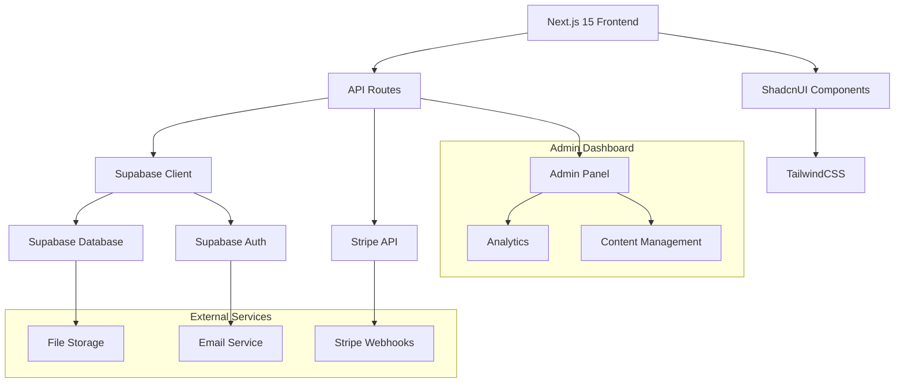

# Technical Design

## Overview
大学授業口コミプラットフォーム「City2」の技術設計書。Next.js 15 App Router + Supabase + Stripe構成を採用し、スケーラブルで費用効率的なWebアプリケーションとして設計。企業口コミサイト（OpenWork）の大学授業版として、履修登録支援を目的とした学生向けプラットフォームを実現。

## Architecture



## Technology Stack
- **Frontend**: Next.js 15 App Router + TypeScript
- **UI Framework**: ShadcnUI + TailwindCSS
- **Backend**: Next.js API Routes + TypeScript
- **Database**: Supabase (PostgreSQL)
- **Authentication**: Supabase Auth
- **Payment**: Stripe + Stripe Webhooks
- **File Storage**: Supabase Storage
- **Deployment**: Vercel (推奨) / Docker
- **Testing**: Jest + React Testing Library + Playwright

## Project Structure
```bash
city2/
├── app/                          # Next.js 15 App Router
│   ├── (auth)/                   # 認証関連ページ群
│   │   ├── login/
│   │   ├── register/
│   │   └── layout.tsx
│   ├── (dashboard)/              # メインアプリケーション
│   │   ├── courses/
│   │   ├── reviews/
│   │   ├── premium/
│   │   └── layout.tsx
│   ├── admin/                    # 管理者ダッシュボード
│   ├── api/                      # API Routes
│   │   ├── auth/
│   │   ├── courses/
│   │   ├── reviews/
│   │   ├── stripe/
│   │   └── analytics/
│   ├── globals.css
│   └── layout.tsx
├── components/                   # 再利用可能コンポーネント
│   ├── ui/                       # ShadcnUIコンポーネント
│   ├── forms/
│   ├── layout/
│   └── course/
├── lib/                          # ユーティリティとヘルパー
│   ├── supabase/
│   ├── stripe/
│   ├── utils/
│   └── validations/
├── types/                        # TypeScript型定義
├── hooks/                        # カスタムReactフック
└── public/                       # 静的ファイル
```

## Data Models

### 大学 (Universities)
```typescript
interface University {
  id: string;
  name: string;
  code: string;              // 大学識別コード
  logo_url?: string;
  domain: string;            // メールドメイン (@xxx.ac.jp)
  settings: UniversitySettings;
  created_at: Date;
  updated_at: Date;
}

interface UniversitySettings {
  allow_external_users: boolean;
  require_verification: boolean;
  custom_fields: Record<string, any>;
}
```

### ユーザー (Users)
```typescript
interface User {
  id: string;                // Supabase Auth User ID
  email: string;
  university_id: string;
  student_id?: string;
  year?: number;             // 学年
  department?: string;       // 学部・学科
  is_premium: boolean;
  premium_expires_at?: Date;
  is_admin: boolean;
  profile: UserProfile;
  created_at: Date;
  updated_at: Date;
}

interface UserProfile {
  display_name?: string;
  avatar_url?: string;
  bio?: string;
}
```

### 授業 (Courses)
```typescript
interface Course {
  id: string;
  university_id: string;
  course_code: string;       // 授業コード
  name: string;              // 授業名
  instructor: string;        // 教員名
  department: string;        // 開講学部
  credits: number;           // 単位数
  semester: string;          // 開講学期
  year: number;              // 開講年度
  description?: string;
  syllabus_url?: string;
  
  // 集計データ
  avg_rating: number;        // 平均評価
  avg_difficulty: number;    // 平均難易度
  avg_workload: number;      // 平均課題量
  review_count: number;      // レビュー数
  
  created_at: Date;
  updated_at: Date;
}
```

### 口コミ・レビュー (Reviews)
```typescript
interface Review {
  id: string;
  course_id: string;
  user_id: string;
  
  // 評価項目
  overall_rating: number;    // 総合評価 (1-5)
  difficulty: number;        // 難易度 (1-5)
  workload: number;          // 課題量 (1-5)
  
  // コンテンツ
  title: string;
  content: string;
  semester_taken: string;    // 受講学期
  year_taken: number;        // 受講年度
  
  // 評価・管理
  helpful_votes: number;     // 参考になった投票数
  is_verified: boolean;      // 管理者承認済み
  is_flagged: boolean;       // 報告済み
  
  // 匿名化情報
  anonymous_user_info: {
    year?: number;
    department?: string;
  };
  
  created_at: Date;
  updated_at: Date;
}
```

### プレミアム機能 (Premium Features)
```typescript
interface PastExam {
  id: string;
  course_id: string;
  uploaded_by: string;
  title: string;
  exam_type: 'midterm' | 'final' | 'quiz' | 'assignment';
  year: number;
  semester: string;
  file_url: string;
  file_size: number;
  download_count: number;
  is_approved: boolean;
  created_at: Date;
}

interface SubscriptionPlan {
  id: string;
  name: string;
  stripe_price_id: string;
  price: number;
  currency: string;
  interval: 'month' | 'year';
  features: string[];
  is_active: boolean;
}
```

## API Design

### 認証 API
```typescript
// POST /api/auth/register
interface RegisterRequest {
  email: string;
  password: string;
  university_id: string;
  student_id?: string;
}

// POST /api/auth/login
interface LoginRequest {
  email: string;
  password: string;
}
```

### 授業 API
```typescript
// GET /api/courses?page=1&limit=20&search=&department=&sort=
interface CourseListResponse {
  courses: Course[];
  total: number;
  page: number;
  limit: number;
}

// GET /api/courses/[id]
interface CourseDetailResponse {
  course: Course;
  reviews: Review[];
  stats: CourseStats;
}

// POST /api/courses (管理者専用)
interface CreateCourseRequest {
  university_id: string;
  course_code: string;
  name: string;
  instructor: string;
  department: string;
  credits: number;
  semester: string;
  year: number;
}
```

### レビュー API
```typescript
// GET /api/reviews?course_id=&user_id=&sort=
interface ReviewListResponse {
  reviews: Review[];
  total: number;
}

// POST /api/reviews
interface CreateReviewRequest {
  course_id: string;
  overall_rating: number;
  difficulty: number;
  workload: number;
  title: string;
  content: string;
  semester_taken: string;
  year_taken: number;
}

// PUT /api/reviews/[id]/helpful
interface VoteHelpfulRequest {
  helpful: boolean;
}
```

### プレミアム API
```typescript
// POST /api/stripe/create-subscription
interface CreateSubscriptionRequest {
  price_id: string;
  return_url: string;
}

// POST /api/stripe/webhooks
// Stripe Webhook処理

// GET /api/premium/past-exams/[course_id]
interface PastExamResponse {
  exams: PastExam[];
  access_granted: boolean;
}
```

## Components and Interfaces

### 認証コンポーネント
```typescript
// components/auth/LoginForm.tsx
interface LoginFormProps {
  onSuccess: (user: User) => void;
  redirectTo?: string;
}

// components/auth/RegisterForm.tsx
interface RegisterFormProps {
  universities: University[];
  onSuccess: (user: User) => void;
}
```

### 授業関連コンポーネント
```typescript
// components/course/CourseCard.tsx
interface CourseCardProps {
  course: Course;
  showUniversity?: boolean;
  variant?: 'default' | 'compact';
}

// components/course/CourseDetail.tsx
interface CourseDetailProps {
  course: Course;
  reviews: Review[];
  canReview: boolean;
}

// components/course/SearchFilters.tsx
interface SearchFiltersProps {
  universities: University[];
  departments: string[];
  onFilterChange: (filters: CourseFilters) => void;
}
```

### レビューコンポーネント
```typescript
// components/review/ReviewCard.tsx
interface ReviewCardProps {
  review: Review;
  showCourse?: boolean;
  canVote: boolean;
}

// components/review/ReviewForm.tsx
interface ReviewFormProps {
  course: Course;
  onSubmit: (review: CreateReviewRequest) => Promise<void>;
}
```

## Error Handling

### エラー分類
```typescript
enum ErrorType {
  VALIDATION = 'VALIDATION',
  AUTHENTICATION = 'AUTHENTICATION',
  AUTHORIZATION = 'AUTHORIZATION',
  NOT_FOUND = 'NOT_FOUND',
  RATE_LIMIT = 'RATE_LIMIT',
  EXTERNAL_SERVICE = 'EXTERNAL_SERVICE',
  INTERNAL = 'INTERNAL'
}

interface APIError {
  type: ErrorType;
  message: string;
  code: string;
  details?: Record<string, any>;
}
```

### エラーハンドリング戦略
- **バリデーションエラー**: Zod + react-hook-formによるクライアント・サーバー両側検証
- **認証エラー**: Supabase Auth自動リダイレクト + トースト通知
- **ネットワークエラー**: 自動リトライ + オフライン対応
- **レート制限**: 指数バックオフ + ユーザー通知
- **サーバーエラー**: Sentry連携 + フォールバック表示

## Security Considerations

### 認証・認可
- **Supabase Auth**: JWT Token + Row Level Security (RLS)
- **API保護**: ミドルウェアによる認証確認
- **管理者権限**: role-based access control (RBAC)
- **セッション管理**: 自動更新 + セキュアCookie

### データ保護
- **入力サニタイゼーション**: XSS防止 + SQL injection対策
- **データ暗号化**: 個人情報のフィールドレベル暗号化
- **ファイルアップロード**: ウイルススキャン + 拡張子制限
- **レート制限**: IP-based + user-based制限

### プライバシー
- **匿名化**: レビュー投稿者の個人情報保護
- **データ削除**: GDPR対応 + ユーザー要求による削除
- **アクセスログ**: 最小限の情報記録 + 定期削除

## Performance & Scalability

### Next.js最適化
```typescript
// app/courses/[id]/page.tsx - Static Generation
export async function generateStaticParams() {
  const courses = await getCourses();
  return courses.map((course) => ({
    id: course.id,
  }));
}

// キャッシング戦略
export const revalidate = 3600; // 1時間キャッシュ
```

### データベース最適化
```sql
-- インデックス戦略
CREATE INDEX idx_courses_university_department ON courses(university_id, department);
CREATE INDEX idx_reviews_course_created ON reviews(course_id, created_at DESC);
CREATE INDEX idx_reviews_helpful_votes ON reviews(helpful_votes DESC);

-- 集計データの事前計算
CREATE OR REPLACE FUNCTION update_course_stats()
RETURNS TRIGGER AS $$
BEGIN
  UPDATE courses SET
    avg_rating = (SELECT AVG(overall_rating) FROM reviews WHERE course_id = NEW.course_id),
    avg_difficulty = (SELECT AVG(difficulty) FROM reviews WHERE course_id = NEW.course_id),
    avg_workload = (SELECT AVG(workload) FROM reviews WHERE course_id = NEW.course_id),
    review_count = (SELECT COUNT(*) FROM reviews WHERE course_id = NEW.course_id)
  WHERE id = NEW.course_id;
  RETURN NEW;
END;
$$ LANGUAGE plpgsql;
```

### キャッシング戦略
- **ページキャッシュ**: Next.js ISR + CDN
- **データキャッシュ**: React Query + Supabase Real-time
- **静的アセット**: Vercel Edge Network
- **API応答**: HTTP Cache Headers

## Testing Strategy

### 単体テスト
```typescript
// components/course/CourseCard.test.tsx
import { render, screen } from '@testing-library/react';
import { CourseCard } from './CourseCard';

describe('CourseCard', () => {
  const mockCourse: Course = {
    id: '1',
    name: 'データベース論',
    instructor: '田中教授',
    avg_rating: 4.2,
    review_count: 15,
    // ... other fields
  };

  it('should display course information correctly', () => {
    render(<CourseCard course={mockCourse} />);
    
    expect(screen.getByText('データベース論')).toBeInTheDocument();
    expect(screen.getByText('田中教授')).toBeInTheDocument();
    expect(screen.getByText('4.2')).toBeInTheDocument();
  });
});
```

### 統合テスト
```typescript
// __tests__/api/courses.test.ts
import { GET } from '@/app/api/courses/route';
import { createMockRequest } from '@/test-utils/api';

describe('/api/courses', () => {
  it('should return paginated course list', async () => {
    const request = createMockRequest({
      method: 'GET',
      url: '/api/courses?page=1&limit=10',
    });

    const response = await GET(request);
    const data = await response.json();

    expect(response.status).toBe(200);
    expect(data.courses).toHaveLength(10);
    expect(data.total).toBeGreaterThan(0);
  });
});
```

### E2Eテスト
```typescript
// e2e/course-review.spec.ts
import { test, expect } from '@playwright/test';

test('user can submit course review', async ({ page }) => {
  await page.goto('/login');
  await page.fill('[data-testid=email]', 'test@university.ac.jp');
  await page.fill('[data-testid=password]', 'password');
  await page.click('[data-testid=login-button]');

  await page.goto('/courses/1');
  await page.click('[data-testid=write-review-button]');
  
  await page.selectOption('[data-testid=overall-rating]', '5');
  await page.fill('[data-testid=review-title]', 'とても良い授業でした');
  await page.fill('[data-testid=review-content]', '分かりやすい説明で...');
  
  await page.click('[data-testid=submit-review]');
  await expect(page.locator('[data-testid=success-message]')).toBeVisible();
});
```

## Development Workflow

### 環境設定
```bash
# 開発環境セットアップ
npm install
cp .env.example .env.local
npm run dev

# テスト実行
npm run test          # 単体テスト
npm run test:e2e      # E2Eテスト
npm run test:coverage # カバレッジレポート

# ビルドとデプロイ
npm run build
npm run start
```

### 品質管理
- **ESLint + Prettier**: コード品質とフォーマット
- **TypeScript**: 型安全性
- **Husky + lint-staged**: プリコミットフック
- **GitHub Actions**: CI/CD + 自動テスト
- **SonarQube**: コード品質分析